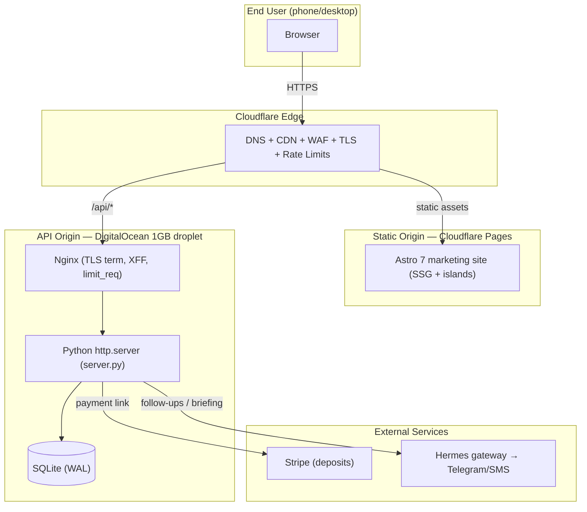
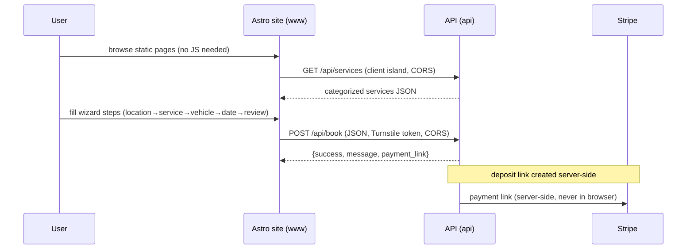

# On-Wheels Detailing — Booking Dataflow & Architecture

> Authoritative reference for how data moves through the On-Wheels stack.
> Current state + Astro target. Last updated 2026-09-03.

---

## 1. Topology



ASCII fallback:

```
 [Browser] --HTTPS--> [Cloudflare CDN/WAF]
                           |-- static --> [CF Pages: Astro site]
                           `-- /api/*  --> [Nginx] --> [Python server.py]
                                                              |
                                                     [SQLite (WAL)]
                    [Stripe] <-- deposit link --/
                    [Hermes/Telegram] <-- follow-ups --/
```

---

## 2. Components & trust boundaries

| Zone | Host | Trust level | Secrets |
|------|------|-------------|---------|
| Edge | Cloudflare | Untrusted ingress | CF account token only |
| Static site | Cloudflare Pages | Public | NONE (must stay secret-free) |
| API | DO droplet (Nginx + Python) | Semi-trusted | `ONWHEELS_API_KEY`, `ONWHEELS_ADMIN_KEY` |
| Data | SQLite (same droplet) | Private | n/a |
| Stripe | stripe.com | External (PCI) | Stripe keys (server-side) |

**Hard rule:** the Astro site ships zero secrets. It only calls the two
public endpoints below. The read/admin dashboard endpoints are key-gated and
are never reachable from the marketing site.

---

## 3. Current dataflow (today)

### Public endpoints (no API key — `PUBLIC_PATHS`)
- `GET /` and `GET /book` → server-rendered `booking.html` (bare form)
- `GET /api/services` → categorized service catalog (JSON)
- `POST /api/book` → create customer + vehicle + appointment + follow-up
- `GET /static/*` → static assets

### Private endpoints (X-API-Key header, dual-tier)
- `GET /dashboard` → HTML dashboard (read)
- `GET /api/dashboard`, `GET /api/appointments` → JSON (read)
- Write/update operations → admin key

### Booking flow (current)
1. User hits `www.onwheelsdetailing.com` → `book.html` 301-redirects to
   `api.onwheelsdetailing.com/` (cross-origin jump, off-brand).
2. `booking.html` (Python-rendered) loads service list from `GET /api/services`
   (same origin, so **no CORS needed today**).
3. User submits → `POST /api/book` JSON: name, phone, email, location,
   vehicle fields, `service_id`, preferred date/time, `deposit_agreed`.
4. Server validates (name+phone required, phone ≥10 digits, date ∈ Thu/Sat/Sun,
   body ≤10 KB), sanitizes inputs, rate-limits (5 bookings / 60s / IP).
5. `create_customer` → `add_vehicle` → `create_appointment` (status `New Lead`)
   → if service has a deposit and user agreed, generate a **Stripe payment link**
   and stamp `deposit_agreed_at`.
6. `create_follow_up(appointment_id, "Booking Confirmation", today, "SMS")`.
7. Response: `{success, confirmation message}` (+ `$25` mobile-fee note if the
   location is mobile). Stripe link flows to the follow-up SMS.

### Anything worth noting (current gotchas)
- **No CORS headers.** `json_response()` sets nosniff / frame-deny / referrer /
  no-store, but never `Access-Control-Allow-Origin`. Same-origin today; **breaks
  the moment the wizard moves to `www`**.
- **`products_used` is still returned** by `/api/services` (server.py L342) even
  though a commit claimed to strip it. Marketing decision: the new site ignores
  this field entirely — never render raw chemical names.
- **XFF spoofing.** `_client_ip()` blindly trusts `X-Forwarded-For`. Fine behind
  Nginx *if* Nginx overwrites it; a spoofable footgun if the Python port is ever
  exposed directly. → fix in security plan.
- **In-memory rate limiter.** `_RATE_LIMITS` resets on restart and isn't shared.
  Acceptable as a backstop; Nginx + Cloudflare do the real work.
- **Single source of truth** for services is the SQLite `services` table —
  the marketing site must not fork a second price list.
- **Location → DB mapping** (`LOCATION_DB_MAP`) maps the form's friendly labels
  to the DB CHECK-constraint values. New MI/TX structure must stay in sync here.

---

## 4. Astro target dataflow

### Architecture decision: static vs live services

| Surface | Source | Why |
|---------|--------|-----|
| **Services page** (marketing/SEO) | Static content in Astro | SEO, sub-second, survives API outage |
| **Booking wizard** (interactive) | Live `GET /api/services` | DB stays single source of truth for price/availability |
| **Tinting / undercoating pages** | Static content | SEO landing pages, no PII |

This gives resilience: if the API is down, the site still sells; only the
book-now flow degrades (and it should degrade *gracefully*, not silently).

### New booking flow (Astro islands)



Steps:
1. **Static pages render instantly** (SSG + CDN). No JS for SEO surfaces.
2. **Booking wizard** is an Astro *island* (hydrated client component) that
   `fetch`es `/api/services` — the DB remains the source of truth.
3. Wizard steps: location (MI mobile / Marysville shop / New Haven / TX) →
   service (from live catalog, filtered by location) → vehicle (make/model/year/
   condition + optional photo) → date (Thu/Sat/Sun) → review & contact.
4. Submit `POST /api/book` with the same payload **plus** new fields for
   tint (film tier + shade %) and undercoating (product + vehicle size).
5. Server does the same validation + a **Turnstile** token check, then creates
   the record and returns the Stripe link.

### Required CRM changes (to unlock the above)
1. **CORS** — `Access-Control-Allow-Origin` for `www` + Pages preview + localhost,
   and an `OPTIONS` preflight handler. *(The one hard blocker.)*
2. **Seed tinting + undercoating** services (GEOShield tiers; Fluid Film/Woolwax).
3. **Extend `/api/book` payload** for tint + undercoating selections.
4. **Location mapping** — sync MI mobile / Marysville / New Haven / TX split.

---

## 5. Data model (entities)

| Table | Key fields | Notes |
|-------|-----------|-------|
| `customers` | id, name, phone, email, location | location has a DB CHECK constraint |
| `vehicles` | id, customer_id, type, make, model, year, color, plate, `vehicle_size` | size drives tiered pricing |
| `services` | id, name, category, sub_service, description, starting_price, pricing_model, `products_used`, duration_hours, deposit_amount | **single source of truth** |
| `appointments` | id, customer_id, service_id, vehicle_id, date, time, job_address, special_requests, status, payment_link, deposit_agreed_at | `status` starts `New Lead` |
| `payments` | id, appointment_id, ... | deposit accounting |
| `follow_ups` | id, appointment_id, type, date, channel | drives SMS/email cadence |

Pricing is tiered by vehicle size (sedan/SUV/truck) via `classify_vehicle_size`
+ `get_service_tier_price`. Mobile fee is a flat `$25` note on mobile locations.

---

## 6. "Run by me" — tech additions beyond the locked stack

The stack is locked to: **Astro 7 + TypeScript + Tailwind v4 + Alpine.js +
Cloudflare Pages + existing Python CRM**. Anything below is *proposed* and
needs explicit sign-off before I wire it in:

- **Cloudflare Turnstile** (bot/CAPTCHA on the booking form) — security control.
- **Geo-fence the API to US** (CF firewall rule) — cuts foreign bot traffic;
  confirm no legit non-US traffic is expected.
- **Sentry** (error tracking for the Astro islands) — later, optional.
